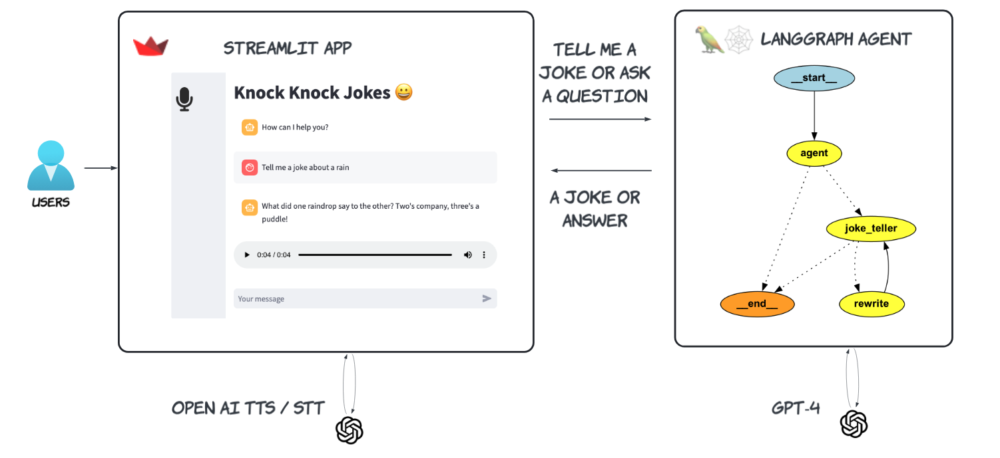
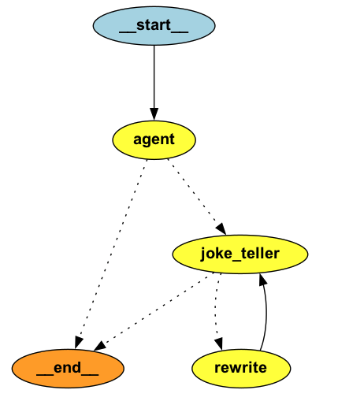

# A ReAct Gen AI Joke Agent
Medium stories
1. [A ReAct Gen AI Joke Agent — Background and Design](https://medium.com/@yuxiaojian/a-react-gen-ai-joke-agent-background-and-design-b46618ba8c5c)
2. [A ReAct Gen AI Joke Agent — The Code]()

## Overview
The ReAct Agent is build with Streamlit, 🦜🕸️ LangGraph and OpenAI Models

<p align="center">
  
</p>

## The ReAct Agent

The agent includes a joke_teller ReAct component. To avoid duplications, I created a Chroma vector store to keep track of old jokes. When the agent creates a new joke, a similarity search is performed in the store to find similar jokes using embedding query technology. The similar jokes and the new joke are then sent to the LLM to determine if it's a duplication. If it is, the agent will be asked for a new joke, along with the last told joke and similar jokes for context. This iteration continues until the LLM produces a genuinely new joke.

The agent node at the entry point acts as a handler to determine if the user wants a joke. It handles other queries or asks the joke_teller node to tell a joke. For example, if the user asks, "Why are there so many gum trees in Australia?" the agent will generate the answer itself.

<p align="center">
  
</p>


## Usage
Switch to the project directory
```bash
pip install -r requirements.txt
```

Import OpenAI API key. The agent uses the OpenAI STT/TTS and the `gpt-4o-mini` model (*You can change `OPENAI_MODE` in the config.py*). 
```bash 
export OPENAI_API_KEY="sk-******"
```
Start the app
```bash 
streamlit run app.py
```
You can dump the jokes 
```bash
python agent_graph.py
```

The app will create a `chroma` folder to store the told jokes. 

### Known issue
Even LLM can run out of ideas :satisfied:. If you keep asking "tell me a joke", as the vector store growing, you may see this error. 
```bash
langgraph.errors.GraphRecursionError: Recursion limit of 25 reached without hitting a stop condition. You can increase the limit by setting the `recursion_limit` config key.
```
That mean the LLM can't work out a new joke after many iterations. So instead of asking "tell me a joke", try to give some hints to the model, like "tell me a joke about xxx"